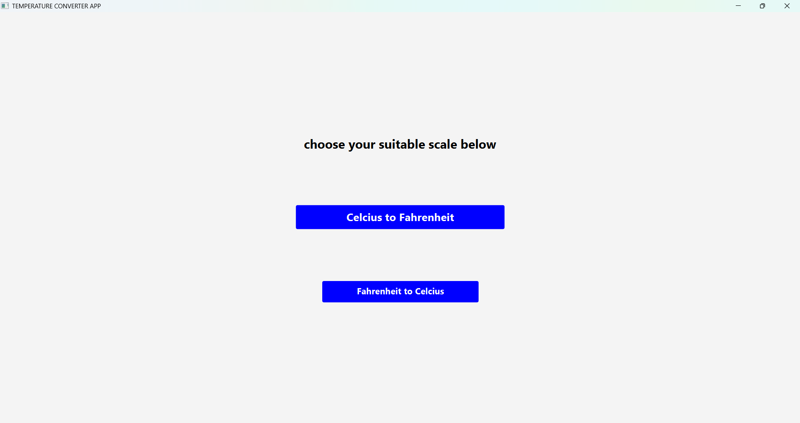
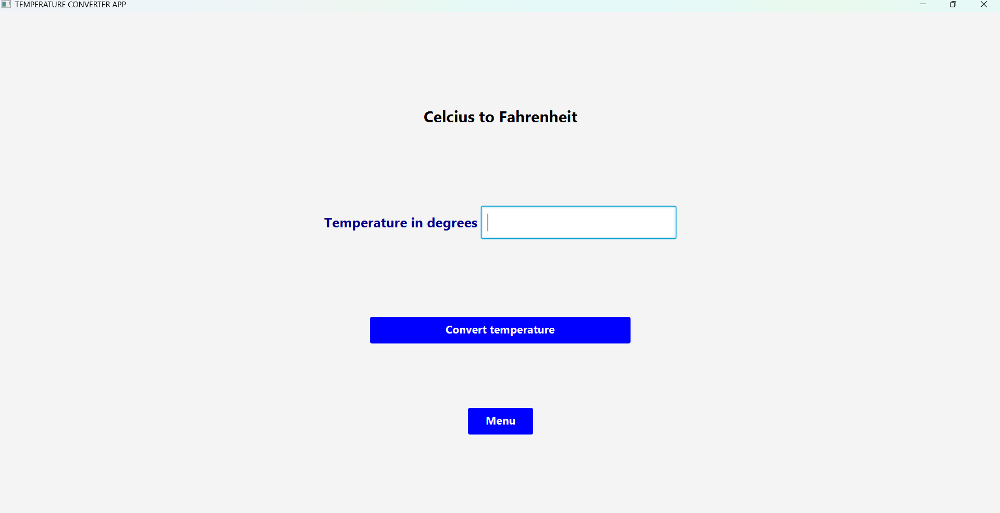
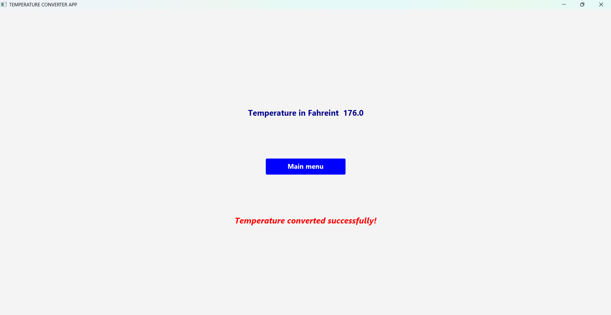
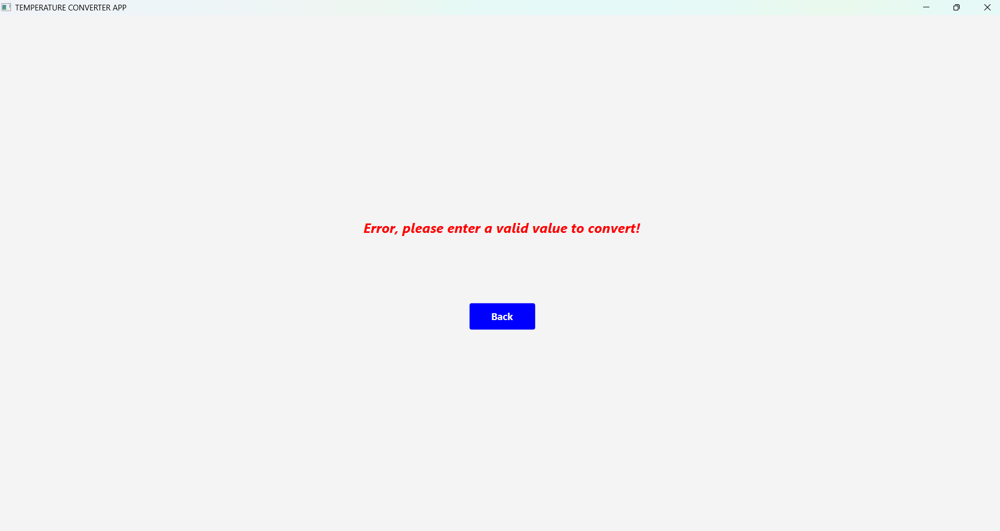

# Temperature Converter (JavaFX)

A simple JavaFX desktop application that converts temperatures between **Celsius and Fahrenheit**.
This project is part of my JavaFX learning journey and focuses on basic UI layout, event handling, and user input processing.

## Features

* Convert **Celsius → Fahrenheit**
* Convert **Fahrenheit → Celsius**
* Simple and clean **JavaFX GUI**
* Input validation to prevent incorrect values
* Instant result display

## Built With

* **Java**
* **JavaFX**
* **VBox and HBox layouts**
* **Labels, TextFields, and Buttons**

## How It Works

1. The user selects the conversion button:

   * **Celsius to Fahrenheit**
   * **Fahrenheit to Celsius**

2. The user enters the temperature value to convert

3. The user selects the convert button 

4.  The application calculates the result and displays it on the screen.

## Temperature Conversion Formulas

1. Celsius to Fahrenheit:

F = (C × 9/5) + 32

2. Fahrenheit to Celsius:

C = (F − 32) × 5/9

## Project Structure

TemperatureConverterApp
│
├── src
│   └── com.example
│       └── TemperatureConverterApp.java
│
└── README.md

## Requirements

* **Java JDK 17+**
* **JavaFX SDK**

## How to run

1. Navigate to the folder

cd TemperatureConverter

2. Run with maven

mvn clean javafx: run

## Screenshots

## What I practised:

* Creating JavaFX layouts using **VBox and HBox**
* Handling **button click events**
* Reading user input from **TextField** - (TextField.getText())
* Performing **basic calculations**
* Displaying results with **Labels**
*  A bit of CSS styling

## Future Improvements

* Add **Kelvin conversion**
* Improve **UI styling with CSS**
* Add **better error messages**
* Create a **dropdown for unit selection**

## Author

Hassan Karungwa;

This is part of my **JavaFX project portfolio** while learning Java GUI development.

## Goals
1. Understand programming well and develop 50+ projects
2. Learn Database connection(SQL)
3. Learn basics of web development
4. Learn APIs

## Vision

Become a powerful problem solver in software development